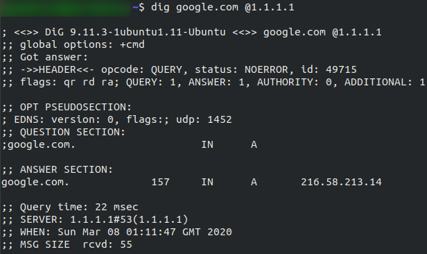
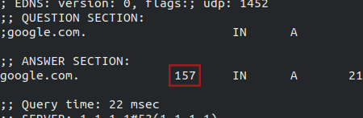

# Essential/basic network tools

## ping
Used to test whether a connection to a remote resource is possible.
Ping works using the ICMP protocol, which works on the Network layer of the OSI Model and Internet layer of the TCP/IP model. 

Basic syntax:
> `ping <target>`

Example:

Ping returned the IP address for the Google server that it connected to, rather than the requested URL. 

Ping manual (on Linux):
> `man ping`

## traceroute
Used to map the path your request takes to the target machine. 
The internet is made many servers, meaning, in order to get to the desired location you need to go through bunch of other servers. Traceroute allows you to see each of these connections. 

Basic syntax:
> `traceroute <destination>`

The Windows traceroute( tracert ) operates using ICMP protocol, the UNIX operates using UDP, this can be altered with switches in both instances. 

Example:

Observe that it took 13 hops to get from my access point(_gateway), mostly router, to the Google server at 216.58.205.46 .

Traceroute manual (on Linux):
> `man traceroute`

## whois
Whois allows you to query who a domain name is registered to. In Europe personal details are redacted; however, elsewhere you can get a great deal of information from a whois search. 

Basic syntax:
> `whois <domain>`

Example: 

This is small information. Notice the domain name, company that registered the domain, the last renewal and the next due date, and info about nameservers. 

Whois manual:
> `man whois`

## dig
Dig allows to manually query recursive DNS servers of our choice for information about domains. 

Basic syntax:
> `dig <domain> @<dns-server-ip>`

It is useful for network troubleshooting. 

Example: 

We sent one query and successfully(i.e. No Errors) received one full answer -- which contains the IP address for the domain name that we queried. TTL(Time To Live) of the queried DNS record, tells your computer when to stop considering the record as being valid -- eg: when it should request the data again, rather than relying on the cached copy. The TTL can be found here: 

Remember that TTL(in context of DNS caching) is measured in seconds. 

### Background info for dig

 - DNS = Domain Name System
   - = a special server that gives us an IP address of a website that we are trying to access

Process of making a request to a website:
Computer checks local cache to se if the IP address is already stored. If yes, done, if not then next stage of process. A request will be sent to a *recursive DNS server*. These are known to the router on my network. Many ISPs maintain their own recursive servers, but companies such as Google and OpenDNS also control recursive servers. If a website requested is not in the cache, the recursive server will pass the request on to a *root name server*. 

### Top-Level Domain (TLD)
There are 13 root name DNS servers in the world. They keep track of the DNS servers in the next level down, choosing appropriate one to redirect your request to. These lower level servers are called Top-Level Domain(TLD) servers. 

TLD servers are split into extensions.
 - eg: if you visit tryhackme**.com**, redirect would be to .com TLD server
 - eg: if you visit bbc**.co.uk**, redirect would be to .co.uk TLD server

As with root name servers, TLD servers keep track of the next level down: Authoritative name servers. When a TLD server receives your request for info, the server passes it down to an appropriate Authoritive name server. 

Authoritative name servers are used to store DNS records for domains directly -- every domain in the world will have its DNS records stored on an Authoritative name server somewhere or another; they are the source of the information. When your request reaches the authoritative name server for the domain querying, it will send relevant information back to you, allowing your computer to connect to the OP address behind the domain requested. 

## Expand on networking:
[ICND1 book](https://www.amazon.co.uk/Interconnecting-Cisco-Network-Devices-ICND1/dp/1587054620/ref=sr_1_1?keywords=Interconnecting+Cisco+Network+Devices%2C+Part+1&qid=1583683766&sr=8-1 "Interconnecting Cisco Network Devices")
