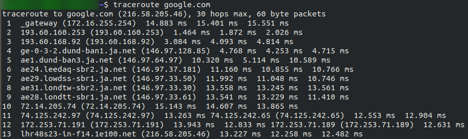
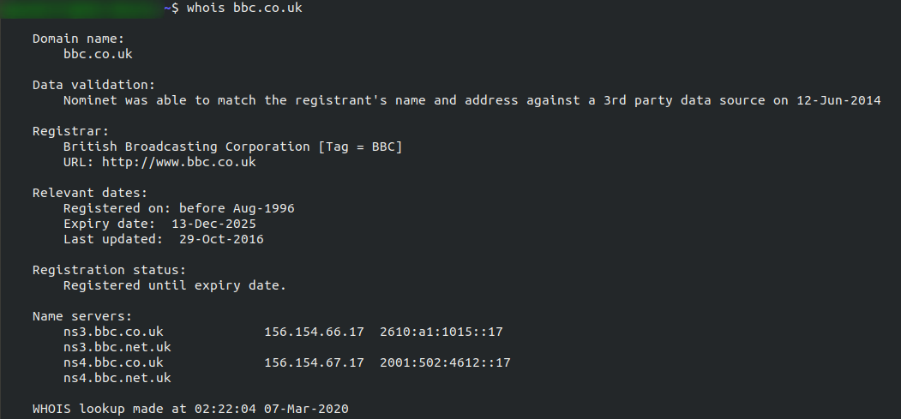

# Essential/basic networking tools

## ping
Used to test whether a connection to a remote resource is possible.
Ping works using the ICMP protocol, which works on the Network layer of the OSI Model and Internet layer of the TCP/IP model. 

Basic syntax:
> `ping <target>`

Example:

Ping returned the IP address for the Google server that it connected to, rather than the requested URL. 

Ping manual (on Linux):
> `man ping`

## traceroute
Used to map the path your request takes to the target machine. 
The internet is made many servers, meaning, in order to get to the desired location you need to go through bunch of other servers. Traceroute allows you to see each of these connections. 

Basic syntax:
> `traceroute <destination>`

The Windows traceroute( tracert ) operates using ICMP protocol, the UNIX operates using UDP, this can be altered with switches in both instances. 

Example:

Observe that it took 13 hops to get from my access point(_gateway), mostly router, to the Google server at 216.58.205.46 .

Traceroute manual (on Linux):
> `man traceroute`

## whois
Whois allows you to query who a domain name is registered to. In Europe personal details are redacted; however, elsewhere you can get a great deal of information from a whois search. 

Basic syntax:
> `whois <domain>`

Example: 

This is small information. Notice the domain name, company that registered the domain, the last renewal and the next due date, and info about nameservers. 

Whois manual:
> `man whois`

## dig
