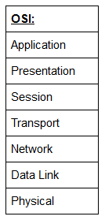
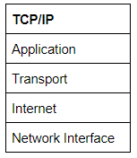

# OSI and TCP/IP

## OSI
The Osi, a standard model to demo the theory behind computer networking. TCP/IP model, is the actual real-world model. 
7 layers f the OSI model: 

### Layer 7 -- Application
Networking options to programs running on a computer, **providing an interface**. 
When data is given to the Application layer, it is passed down into the Presentation layer.

### Layer 6 -- Presentation
Receives data from Application layer, the data teends to be in a format the application understands,  which is not necessarily in the standardised format that could be understood but the application layer on the receiving computer. 
Presentation layer **translates the data into a standardised format**, handling any encryption, compression or other data transformations. Data is passed down to the Session layer.

### Layer 5 -- Session
Receives correctly formatted data from the Presentation layer. **It looks to make a connection with the computer across the network**. If it cannot, an error is sent back, and the process goes no further. If a session can be estabilished, then **it is the Session layer's job to maintain, cooperate with the remote computer's Session layer**. When connection is successfuly logged, the data is passed down to the Transport layer. 

### Layer 4 -- Transport
First purpose is to choose the protocol over which the data is to be transmitted. 
 - 2 most common protocols: 
   + TCP(=Transmission Control Protocol)
   + UDP(=User Datagram Protocol)

A TCP connection allows the two computers to remain in constant communication to ensure that the data is sent at an acceptable speed, and that any lost data is re-sent. With UDP, the opposite is true; packets of data are essentially thrown at the receiving computer -- if it can't keep up then that's its problem (this is why a video transmission over something like Skype can be pixelated if the connection is bad). What this means is that TCP would usually be chosen for situations where accuracy is favoured over speed (e.g. file transfer, or loading a webpage), and UDP would be used in situations where speed is more important (e.g. video streaming).

**With a protocol selected, the transport layer then divides the transmission up into bite-sized pieces** (over TCP these are called **segments**, over UDP they're called **datagrams**), which makes it easier to transmit the message successfully. 

 - packet segmentation = process of dividing a data packet into smaller units for transmission over the network
 - datagram = independent entity of data carrying sufficient info to be routed from the source to destination without relience on early exchanges

### Layer 3 -- Network
**Responsible for locating the destination of your request**. It is the Network layer that takes the IP address for the page **and figures the best route to take**. 
At this stage we work with Logical addressing which are still software controlled. Logical addresses provide order to networks, categorising them and allowing us to sort them. These are currently IPv4 and IPv6. 

### Layer 2 -- Data Link
Focuses on the physical addressing of the transmission. **A packet from Network layer is received(with the remote IP) and adds in MAC address of the receiving endpoint**. 
Inside every network enabled computer is a Network Interface Card(NIC) with a unique Media Access Control(MAC) to identify it. 

MAC is set and burnt into the card by the manufacturer -- but can be spoofed. 

Additionally the **job of the Data Link layer is to present the data in a format suitable for transmission**. Data Link, **on the receiving end, checks the received information to make sure it is not corrupted**, which can happen during layer 1 transmission -- Physical. 

### Layer 1 -- Physical
Hardware of the computer.
The electrical pulses that make up data transfer over a network over a network are sent and received. 
The job of the Physical layer is to convert the binary data of the transmission into signals and transmit them across the network, as well as convert receiving signals back into binary data. 

## Encapsulation
The data is passed down each layer of the model, more information containing details specific to the layer. 

Notice that the encapsulated data is given a different name at different steps of the process. In layers 7,6 and 5, the data is simply referred to as data. In the transport layer the encapsulated data is referred to as a segment or a datagram.
When the message is received by the second computer, it reverses the process -- __de-encapsulation__.

## TCP/IP
Basis for real-world networking, consisting of 4 layers: Application, Transport, Internet, Network Interface. Between them, they cover the same range of functions as the 7 layers of the OSI. 

